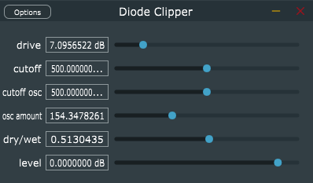

# Diode-Clipper

This repository contains a C++ implementation of a Diode Clipper plugin with Wave Digital Filters using the chowdsp_wdf library. 

The audio plugin contains a WDF diode clipper that clips an audio signal and a WDF LC Oscillator that is mapped to the cutoff value of the diode clipper. 

