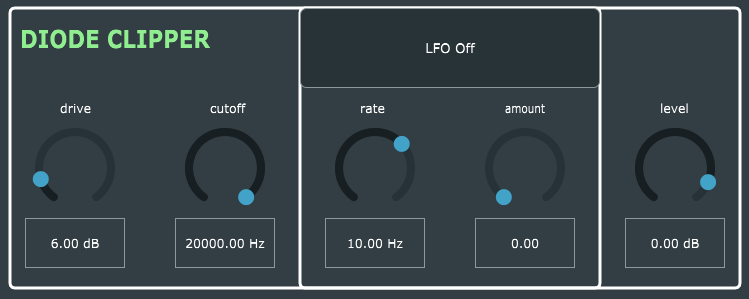

# Diode-Clipper

This repository contains a C++ implementation of a Diode Clipper plugin following the theory of Wave Digital Filters using the [chowdsp_wdf](https://github.com/Chowdhury-DSP/chowdsp_wdf) library.

The audio plugin (which is still in progress) contains a WDF diode clipper and a WDF LC Oscillator that is mapped to the cutoff value of the diode clipper. 

